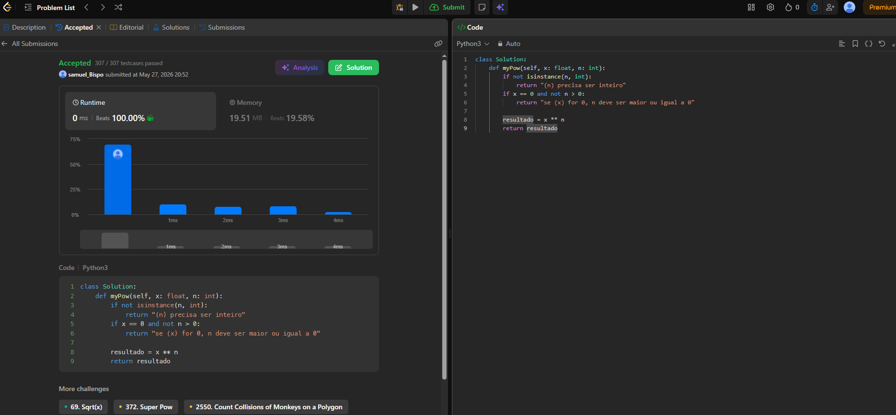
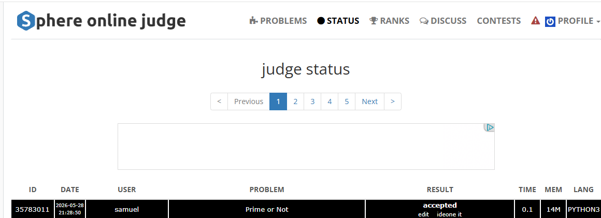

# Programação Competitiva

## Integrante

Samuel Abreu

---

# Descrição

Pasta destinada aos exercícios e atividades de programação competitiva da disciplina de Computabilidade.

## Problemas Resolvidos

* https://leetcode.com/problems/powx-n/description/ *(Pow(x, n))*
* https://www.spoj.com/problems/PON/ *(PON - Prime or Not)*

---

# Problema 1 — Pow(x, n)

## Link do Problema

https://leetcode.com/problems/powx-n/description/

## Código

```python
class Solution:
    def myPow(self, x: float, n: int):
        if not isinstance(n, int):
            return "(n) precisa ser inteiro"

        if x == 0 and not n > 0:
            return "se (x) for 0, n deve ser maior ou igual a 0"

        resultado = x ** n
        return resultado
```

## Foto da Submissão

```md

```

## Lógica

A lógica desse problema é que são pedidos 2 números: um deles representa a base da potência, armazenado na variável “x”, e o outro representa a quantidade de vezes que esse número será multiplicado por ele mesmo “n”.

Após esses valores recebidos, eles são mandados para a função `myPow`, que verifica se os valores são válidos (como verificar se “n” é inteiro e se, quando “x” for 0, o valor de “n” será maior que 0, evitando divisão por zero).

Após essa verificação, é utilizada a operação de potência, na qual o “x” é multiplicado por ele mesmo pela quantidade de vezes determinada pelo “n”, retornando o resultado final.

No ponto de vista da computabilidade, esse código mostra condicionais em ação, verificando se um número pertence ao conjunto de entradas válidas para a realização da operação.

---

# Problema 2 — PON (Prime or Not)

## Link do Problema

https://www.spoj.com/problems/PON/

## Código

```python
def miller_rabin(n, a):
    if n % a == 0:
        return n == a

    r = 0
    d = n - 1

    while d % 2 == 0:
        r += 1
        d = d // 2

    x = pow(a, d, n)

    if x == 1 or x == n - 1:
        return True

    for _ in range(r - 1):
        x = pow(x, 2, n)

        if x == n - 1:
            return True

    return False


def is_prime(n):
    if n < 2:
        return False

    bases = [2, 3, 5, 7, 11, 13, 17, 19, 23, 29, 31, 37]

    for a in bases:
        if not miller_rabin(n, a):
            return False

    return True


t = int(input())

for _ in range(t):
    n = int(input())

    if is_prime(n):
        print("YES")
    else:
        print("NO")
```

## Foto da Submissão

```md

```

## Lógica

A lógica desse problema é verificar se um número é primo ou não.

No primeiro método utilizado, eram feitas várias divisões do número por outros valores até sua raiz quadrada, verificando se existia algum divisor além de 1 e dele mesmo. Porém, para números muito grandes, esse método causava erro de tempo excedido (*Time Limit Exceeded*).

Para resolver o problema, foi utilizado o algoritmo Miller-Rabin, que utiliza propriedades matemáticas dos números primos para verificar se o número se comporta como primo ou não.

O algoritmo realiza cálculos utilizando exponenciação modular rápida (`pow(a, d, n)`), que serve para calcular o resto de uma exponenciação de forma eficiente, tornando a execução muito mais rápida mesmo para números extremamente grandes.

No ponto de vista da computabilidade, esse código mostra como diferentes algoritmos podem resolver o mesmo problema, porém com eficiências diferentes (notação Big-O). Além disso, utiliza condicionais e propriedades matemáticas para decidir se o número pertence ao conjunto dos números primos ou não.
